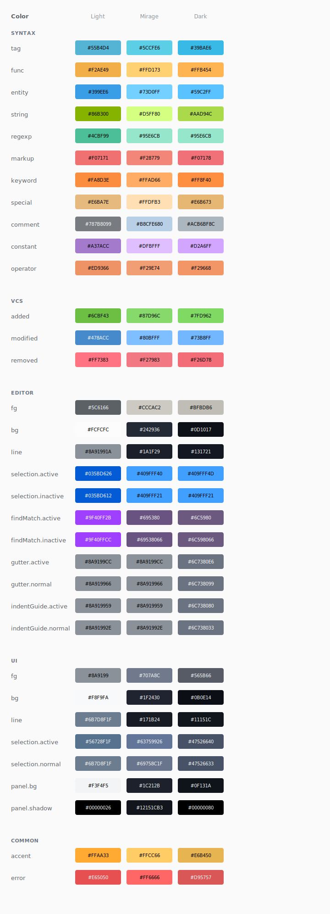

# ayu colors

The color palette from the [ayu theme](https://github.com/ayu-theme/ayu) as an npm package.

## Usage

```typescript
import { dark, light, mirage } from 'ayu'

// Access colors
dark.syntax.keyword.hex()    // '#FF8F40'
light.editor.bg.hex()        // '#FCFCFC'
mirage.common.accent.hex()   // '#FFCC66'

// RGB values
dark.syntax.string.rgb()     // [170, 217, 76]
```

## Palette


<details>
  <summary>Full palette</summary>

  
</details>

## Ports

* [VS Code](https://github.com/ayu-theme/vscode-ayu)
* [Sublime Text](https://github.com/ayu-theme/ayu)

## License

MIT
